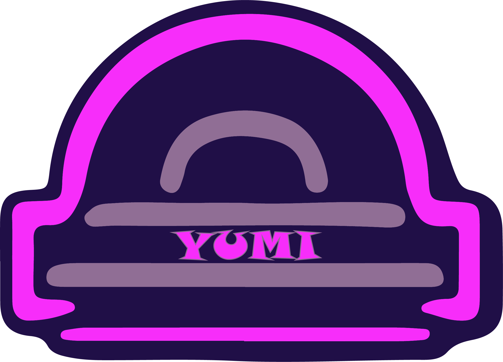
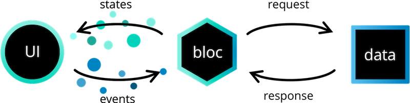
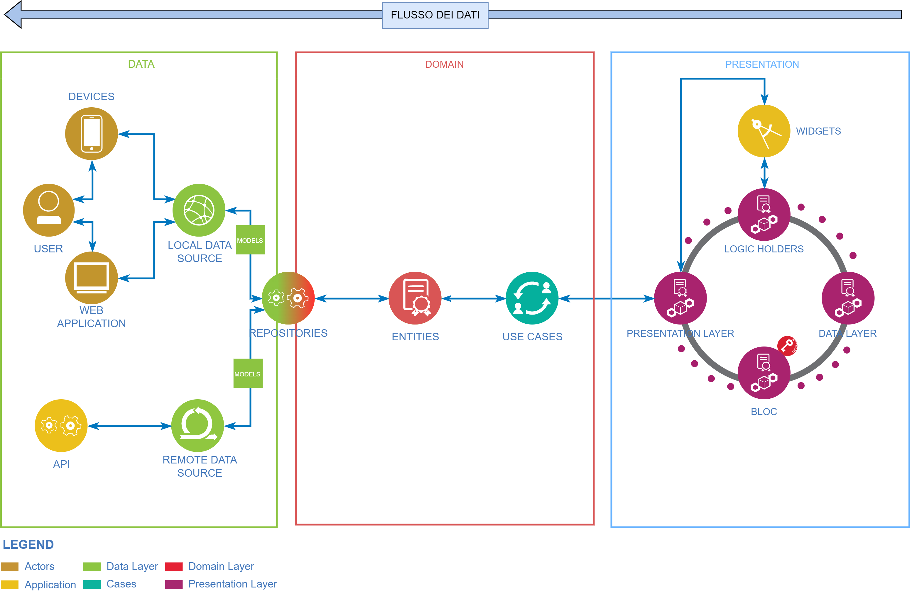

# Yumi - Conversational Agent for Smart Development

Yumi is a conversational agent to work with DART language.
He's been maded as Flutter application in a Client-Server manner where the server respond to API request and the client elaborate and show response.

# Developing Model
It was developed following TDD approach
### What is TDD?

> Test-driven development (TDD) is an evolutionary approach to development
which combines test-first development, where you write a test before you write
just enough production code to fulfil that test, and refactoring. In other words,
it’s one way to think through your requirements
or design before you write your functional code.

*From [Introduction to Test Driven Development (TDD)](https://agiledata.org/essays/tdd.html)*

# Architecture Proposal
We will use BLoC as state management to follow the Clean Architecture Principle

### Schema of Architecture and Data Flow

## Todo
- [ ] Extend GUI
- [ ] Add extra language to the dataset for language modelling
- [ ] Better command-line interface
- [ ] Update requirements.txt

